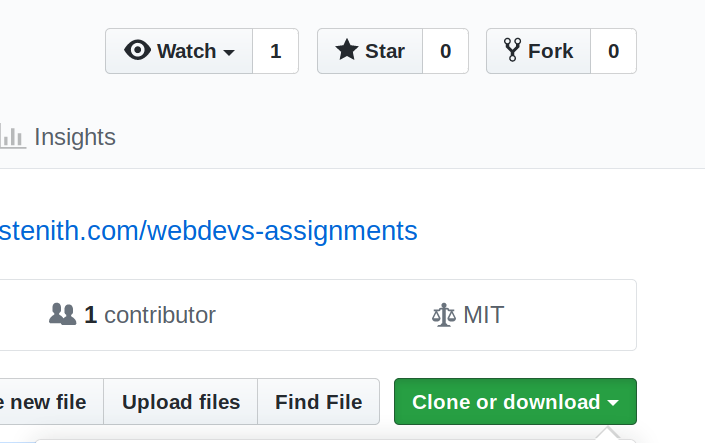
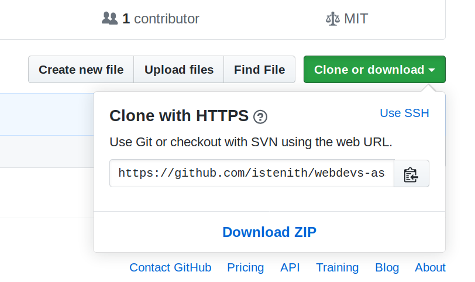

# Webdevs' Assignments
These assignments will help you sharpen your web-d skills.

The assignments are unique in a way that they present a hypothetical yet practical
scenarios that seem intuitive.

The assignments have increasing level of difficulty as you go on following one.
Initial assignments have mentioned what you need to study in order to complete that
challenge, but as you progress are seldom.

You can follow assignments on your own or enroll for mentorship under Team ISTE.

## Mentorship
Under mentorship you will be guided about best practices that would make your
code better and you can ask for help if you get stuck.

### Enrolling for mentorship
Only valid if you are in support period (currently only for ISTE members)

Fork the GitHub repository
[webdevs-assignments](https://github.com/istenith/webdevs-assignments)

Raise an issue, on the main project page; that you want to enroll for mentorship.
You will be assigned a mentor, but anyone from Team **ISTE** can help you.

The purpose of your fork is to enable you to share your code for feedback.

### Following mentorship
Ask your doubts on main assignments repository
[webdevs-assignments](https://github.com/istenith/webdevs-assignments)
so that others having the same problem don't have to ask same question again.

Most of the time you would be pointed towards the link where that problem is
addressed and solved. But you can always follow up, if doubt persists.

If your problem is resolved, your issue will be closed *i.e.* and will be tagged
as **[SOLVED]**

### Before you ask
- Make sure you have already googled it.
- Searched in **[SOLVED]** issues of assignments.

### Submitting a doubt
- Screen shot of the problem would be very helpful with a description.

## Learning
Start solving problems on `learn` branch you create on your system.

**STEP 1**

Create account on GitHub and setup git on your computer by running following
commands on terminal
```
git config --global user.name your_github_username
```
and
```
git config --global user.email your_email_address
```

**STEP 2**

Fork the repository
[webdevs-assignments](https://github.com/istenith/webdevs-assignments)


Clone your fork by running following command on terminal replace with your 
GitHub username
```
git clone https://github.com/your_github_username/webdevs-assignments
```
get clone link by


**STEP 3**

Create a branch named `learn` and checkout `learn`
```
git branch learn
git checkout learn
```
**or** one-liner
```
git checkout -b learn
```

**STEP 4**

Contents of this branch would be same as `master` branch, but we don't need that

Thus delete all file on this branch **(Never do this again)**

To do that run following command
```
rm -r *
```


**STEP 5**

Now you're good to go! To add your solution for assignment-N (**N** is a number)

**m**a**k**e **dir**ectory with
```
mkdir assignment-N
```
or using file explorer, save your `markup.html`&`style.css`&`script.js` in related
assignment folder.


**STEP 6**

After you you complete the assignment or if you face any problem and try to get help,
update your online repository with following commands.

add all changes
```
git add .
```
confirm all changes
```
git commit -m "Your message here; descrbing your commit;"
```
push all changes to remote repository

**First time**
```
git push -u origin learn
```

**Not first time**
```
git push origin learn
```


**NOTE:**
- Never change branch unless you want to submit your solution or submit a problem.


## Submitting solutions
An easy way to write good code is to study good code.
Hence we will also host a solutions branch where solutions to the problems will
be hosted.
The solutions will be selected on First Come First Serve basis when qualifying 
the criteria of *optimum solution*.

You can also suggest changes to pre-existing solutions.


## Submitting problems
You can also submit and rectify problems, those are held on `master` branch.
See `problems_guide.md` for more details.

